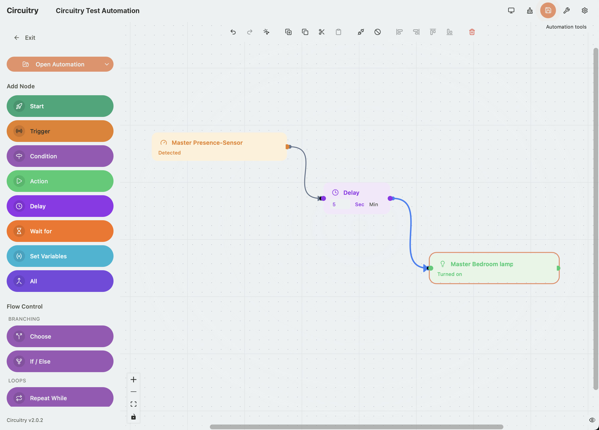
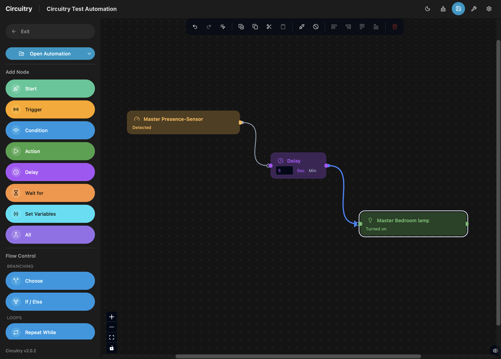

<div align="center">
  

  <h1>Circuitry</h1>

  <p><strong>Visual Flow + Node Editor for Home Assistant</strong></p>

  [](https://github.com/Home-Wizz/circuitry/releases/latest)
  [](https://www.home-assistant.io)
  [](LICENSE)
  [](https://hacs.xyz)

  <br/>

  [Installation](#installation) &nbsp;·&nbsp; [Changelog](CHANGELOG.md) &nbsp;·&nbsp; [Issues](https://github.com/Home-Wizz/circuitry/issues)

  <br/>

  | Light Mode | Dark Mode |
  |:---:|:---:|
  |  |  |

</div>

---

> **Fork notice:** Circuitry is a further fork of [FLODE](https://github.com/SH1FT-W/flode) by [@SH1FT-W](https://github.com/SH1FT-W), which is itself based on [C.A.F.E.](https://github.com/FezVrasta/cafe-hass) by [@FezVrasta](https://github.com/FezVrasta) — with numerous bug fixes, new features, and this rebrand on top. All changes are documented in the [CHANGELOG](CHANGELOG.md), including the point where the rebrand happened.
>
> **Note:** Circuitry is designed not to overwrite any existing data. Nevertheless, we recommend backing up your automations before editing them. If you're upgrading from FLODE, see the [Upgrading from FLODE](#upgrading-from-flode) section below.

---

## What is Circuitry?

**Circuitry** is a visual flow editor for Home Assistant automations — inspired by Node-RED, but without an external server. You draw your automations as diagrams and Circuitry automatically transpiles them into **100% native Home Assistant YAML**, stored directly in the HA core.

No vendor lock-in. No external service. Automations remain fully editable in HA's built-in editor.

---

## Features

| Feature | Description |
|---|---|
| 🎯 **Visual editor** | Drag and drop triggers, conditions, and actions onto a canvas |
| ↩️ **Undo/Redo** | Cmd+Z / Cmd+Shift+Z on the canvas — rapid changes like a drag or a run of keystrokes coalesce into a single step |
| ⚡ **Quick-add on drop** | Drag a connection onto empty canvas to search and add the next node, auto-wired |
| 📄 **100% native YAML** | No proprietary format — standard HA automation YAML |
| 🔄 **Bidirectional** | Import, edit, and save back existing HA automations |
| 🐛 **Trace overlay** | See a real automation run highlighted directly on the canvas — executed, skipped, and errored nodes, right in the diagram |
| 🔀 **State machines** | Complex loops via an automatic state machine pattern |
| 🧭 **Flow control** | Choose, If/Else, Repeat While, Repeat N×, and Parallel as draggable blocks |
| 🧩 **Native HA UI** | Uses Home Assistant's own theme and native components (pickers, selects, more-info dialogs, etc.) wherever possible |
| 🏷️ **Full metadata & targeting** | Set icon, category, labels, and area on save; target actions by area, device, label, or floor |
| 🔗 **Deep links** | Open Circuitry straight into a specific automation from any dashboard button |
| 🩺 **Diagnostics & Repairs** | Native HA diagnostics download, and Repair issues for automations that couldn't be imported losslessly |
| 🌍 **DE & EN** | Full i18n support, with a per-installation language override |
| 🌗 **Dark & light mode** | Follows your configured HA theme by default, or force light/dark independently via the header toggle |

---

## Installation

> **Note:** this repository is not (yet) published to the HACS default store, so it must be
> added as a custom repository — see below. Manual install always works too.

### Via HACS (custom repository)

1. HACS → Integrations → ⋮ menu → Custom repositories → add this repository's URL, category "Integration"
2. HACS → Integrations → Search for **Circuitry** → Install
3. **Restart** Home Assistant
4. Settings → Integrations → Add Integration → **Circuitry**

### Manually (without HACS)

1. Download the latest version from the Releases page (`circuitry.zip`)
2. Copy the `circuitry/` folder to `config/custom_components/circuitry/`
3. Restart Home Assistant
4. Settings → Integrations → Add Integration → **Circuitry**

---

## Upgrading from FLODE

Circuitry is a rename, not a rewrite — but because Home Assistant integrations
are identified by their domain (`circuitry` vs. the old `flode`, and an
internal-only domain used briefly during a private working-copy phase in
between), upgrading in place isn't a simple update:

1. Remove the old FLODE integration (Settings → Devices &
   Services), then install Circuitry as above and add it fresh.
2. **Your automations are safe either way.** Circuitry reads the layout
   metadata FLODE (and, further back, C.A.F.E.) saved into your
   automations' `variables:` block automatically — opening an existing
   automation restores its saved node positions exactly as before. Nothing
   needs to be re-saved or converted manually.
3. Any dashboard buttons using the old `/flode?automation=...` path (or the
   internal-only path used briefly during this project's private
   working-copy phase) need updating to `/circuitry?automation=...` — see
   [Deep Links](#deep-links) below.
4. If anything listens for the old `flode_automation_saved` HA event, update
   it to `circuitry_automation_saved`.

---

## Usage

After setup, **Circuitry** appears in the HA sidebar.

- **New automation** — Start with a trigger node, then connect conditions and actions
- **Import existing** — Load an existing HA automation via the folder icon
- **Save** — Saves directly to Home Assistant as a native automation
- **Export YAML** — View or copy the generated YAML code at any time

---

## Deep Links

Circuitry can be opened straight into a specific automation (or a blank editor)
via URL query parameters on its panel path:

- `/circuitry?automation=automation.xyz` — opens the editor with that automation loaded
- `/circuitry?new=1` — starts a blank new automation

This makes "Edit in Circuitry" buttons possible from any dashboard, e.g. with a
`button-card` or the built-in **Button Card**'s `navigate` action:

```yaml
type: button-card
name: Edit in Circuitry
icon: mdi:pencil
tap_action:
  action: navigate
  navigation_path: /circuitry?automation=automation.motion_light_entrance
```

Circuitry also fires a `circuitry_automation_saved` event on HA's event bus after
every save, with the automation's `entity_id` in the event data — so other
automations/scripts can react to "this automation was just edited in Circuitry".

---

## Native Home Assistant UI

Circuitry renders directly inside HA's own document (no iframe) and, wherever
possible, uses HA's **own native components** instead of custom-built ones —
entity/device/area pickers, the service picker, dropdowns, toggles, and most
form fields (text, number, date, time, duration, templates, JSON) all come
straight from Home Assistant, so they get HA's live entity data, icons,
friendly names, and — automatically, no configuration needed — your active
HA theme, including light/dark mode and custom themes.

These are undocumented, internal HA components without a stability
guarantee. Circuitry checks for each one before using it and **falls back to its
own equivalent control** if it isn't available (e.g. very old or very new HA
versions, or when running Circuitry outside of Home Assistant during
development) — you'll see a one-time notice if that happens, but the editor
keeps working either way.

---

## Technology

- **Frontend:** React 18, Vite, Tailwind CSS, React Flow (xyflow), Zustand, i18next
- **Transpiler:** TypeScript, js-yaml, ELK layout engine
- **Validation:** Zod schemas
- **Tests:** Vitest
- **HA integration:** Python, custom panel via `panel_custom`

---

## Changelog

All changes can be found in the [CHANGELOG.md](CHANGELOG.md).

---

## License

Apache 2.0 — see [LICENSE](LICENSE)

---

<div align="center">
  <sub>Fork of <a href="https://github.com/SH1FT-W/flode">FLODE</a> by SH1FT-W, itself based on <a href="https://github.com/FezVrasta/cafe-hass">C.A.F.E.</a> by Federico Zivolo · Actively developed with <a href="https://claude.ai">Claude (Anthropic)</a></sub>
</div>
